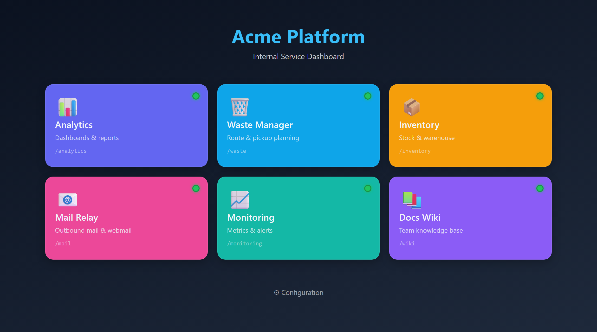
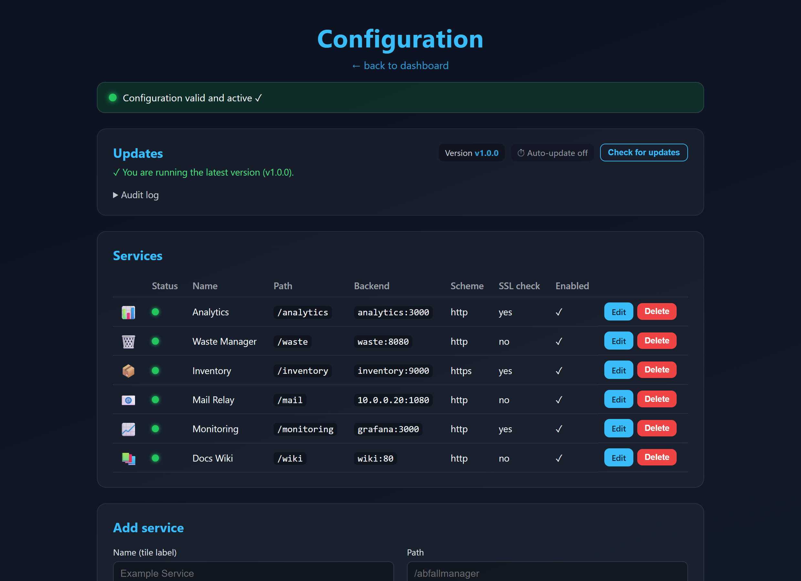

# Acme Platform – HAProxy Reverse Proxy + Dashboard

**Sprache / Language:** Deutsch (dieses Dokument) · [English](README.en.md)


> Schlanker **HAProxy-Reverse-Proxy** mit Kachel-Dashboard und Admin-GUI –
> Routing, TLS, Live-Backend-Status und sichere Updates, alles über die
> Oberfläche konfigurierbar.



Reverse Proxy auf Basis von **HAProxy** mit:

- TLS-Terminierung auf einer **frei konfigurierbaren Domain** (`PLATFORM_DOMAIN`)
- **Kachel-Dashboard** mit konfigurierbarem Erscheinungsbild
- **Pfad-basiertem Routing**: `https://platform.example.local/abfallmanager` → Container „Example Service“
- **Admin-GUI** zum Anlegen/Bearbeiten der Kacheln, Backends und des Designs
- pro Service wählbar: **Container-Name** (gemeinsames Docker-Netz) **oder** Host:Port / IP:Port
- pro Service: http/https zum Backend, **SSL-Prüfung an/aus** (selbstsignierte Backends ok)
- automatischer **Reload** bei Konfig-Änderung (vorher validiert)
- **mehrsprachige Oberfläche** über Sprachpakete (Deutsch & Englisch, erweiterbar)

<details>
<summary>🖥️ Admin-GUI ansehen</summary>



</details>

---

## 1. Schnellstart

```powershell
# 1) (optional) Domain / Admin-Passwort in .env anpassen
notepad .env

# 2) SSL-Zertifikat ablegen (siehe certs\README.txt)
#    -> certs\platform.crt  und  certs\platform.key
#    (ohne Zertifikat wird automatisch ein selbstsigniertes erzeugt)

# 3) starten
docker compose up -d --build
```

Danach im Browser:

- Dashboard: `https://platform.example.local/`
- Admin-GUI: `https://platform.example.local/admin`

> **Hinweis Namensauflösung:** Damit `platform.example.local` auf dem Server/Client
> aufgelöst wird, einen DNS-Eintrag setzen oder die `hosts`-Datei ergänzen, z. B.:
> `127.0.0.1   platform.example.local`
> (Windows: `C:\Windows\System32\drivers\etc\hosts`)

---

## 2. Konfiguration

Alle zentralen Werte stehen in **`.env`**:

| Variable          | Bedeutung                                            |
|-------------------|------------------------------------------------------|
| `PLATFORM_DOMAIN` | Domain, auf die HAProxy reagiert                     |
| `ADMIN_USER`      | Benutzername für das Admin-GUI                       |
| `ADMIN_PASSWORD`  | Passwort fürs Admin-GUI (leer = Admin-GUI **gesperrt**) |
| `TZ`              | Zeitzone                                             |

Services & Design verwaltest du am einfachsten im **Admin-GUI**. Alternativ
direkt in `data\config\services.yaml` (wird beim Speichern bzw. Start in eine
`haproxy.cfg` übersetzt).

---

## 3. Einen Container als Kachel hinzufügen

Im Admin-GUI unter **„Service hinzufügen“**:

| Feld         | Beispiel               | Erklärung                                              |
|--------------|------------------------|--------------------------------------------------------|
| Name         | `Example Service`        | Beschriftung der Kachel                                |
| Pfad         | `/abfallmanager`       | URL-Pfad → `…/abfallmanager`                           |
| Backend      | `abfallmanager:8080`   | Container-Name:Port **oder** `192.168.1.50:8080`       |
| Schema       | `http` / `https`       | wie HAProxy mit dem Backend spricht                    |
| SSL-Prüfung  | aus                    | bei https: Zertifikat des Backends **nicht** prüfen    |
| Pfad entfernen | meist aus            | `/abfallmanager` vor Weiterleitung abschneiden         |

### Backend per Container-Name (gemeinsames Docker-Netz)

Damit HAProxy einen Container über den Namen erreicht, muss dieser im Netz
`acme-platform` hängen. In der `docker-compose.yml` deiner App:

```yaml
services:
  abfallmanager:
    image: dein/abfallmanager
    networks: [acme-platform]

networks:
  acme-platform:
    external: true
```

Im Backend-Feld dann: `abfallmanager:8080`.

### Backend per Host/IP

Läuft die App woanders (anderer Host, fester Port am Docker-Host, andere VM),
trage einfach `host:port` oder `ip:port` ein, z. B. `192.168.1.50:8080`.

### Container aus einem ANDEREN Docker-Projekt erreichen

Docker-Bridge-Netze sind voneinander isoliert – ein Container aus einem anderen
`docker compose`-Projekt ist per Name **nicht** automatisch erreichbar. Zwei Wege:

**A) Über den auf dem Host veröffentlichten Port** (am einfachsten): Wenn der
andere Container einen Port veröffentlicht (`ports: ["8080:80"]`), trage im
Backend-Feld `host.docker.internal:8080` ein. Das ist dank
`extra_hosts: host-gateway` (bereits in der `docker-compose.yml`) auch unter Linux
möglich.

**B) Gemeinsames Netz** (ohne veröffentlichten Port, Routing per Container-Name):
den anderen Container diesem Netz beitreten lassen –

```bash
docker network connect acme-platform <anderer-container>
```

oder dauerhaft in dessen `docker-compose.yml` das externe Netz `acme-platform`
ergänzen (siehe oben). Danach als Backend `<container-name>:<port>` eintragen.

### „Pfad entfernen“ – wann?

- **aus** (Standard): das Backend bekommt den vollen Pfad
  (`/abfallmanager/...`). Richtig, wenn die App weiß, dass sie unter einem
  Unterpfad läuft (Base-Path konfiguriert).
- **an**: HAProxy schneidet `/abfallmanager` ab, das Backend sieht `/...`.
  Richtig für Apps, die unbedingt auf `/` erwarten.

---

## 4. Erscheinungsbild

Im Admin-GUI unter **„Erscheinungsbild & Domain“**: Titel, Untertitel,
Hintergrund-Verlauf, Kachelfarbe/-text, Akzentfarbe und Spaltenanzahl.
Pro Kachel kann zusätzlich eine eigene Farbe und ein Icon (Emoji) gesetzt werden.

**Logo:** im selben Formular hochladbar (png, jpg, svg, gif, webp, ico) inkl.
einstellbarer Anzeigehöhe. Es wird im Dashboard über dem Titel angezeigt, liegt
persistent unter `data\config\` und kann jederzeit ersetzt oder entfernt werden.

### Sprache (Language Packs)

Die Oberfläche ist mehrsprachig. Im Admin-GUI unter **„Erscheinungsbild & Domain“**
lässt sich die **Sprache** umschalten (mitgeliefert: Deutsch, Englisch). Die Auswahl
gilt für Dashboard und Admin gleichermaßen und wird in `services.yaml` gespeichert
(Schlüssel `language`).

**Weitere Sprache hinzufügen:** eine JSON-Datei nach `config-app/lang/<code>.json`
legen (am einfachsten `en.json` kopieren und übersetzen). Der Schlüssel `_name`
enthält den Anzeigenamen; fehlt eine Übersetzung, wird automatisch auf Englisch und
danach auf den Schlüsselnamen zurückgefallen. Die neue Sprache erscheint ohne
Codeänderung automatisch in der Auswahl.

---

## 5. Status, Health & Logs (Admin-GUI)

Das Admin-GUI aktualisiert sich live (Polling alle ~3 s):

- **Validierungs-Banner** oben zeigt, ob die zuletzt generierte Config von HAProxy
  übernommen wurde:
  - 🟢 *gültig und aktiv*
  - 🟠 *Validierung läuft …* (HAProxy prüft die neue Config gerade)
  - 🔴 *abgelehnt* – inkl. Original-Fehlertext von `haproxy -c`; der Proxy läuft
    dabei mit der **letzten gültigen** Config weiter.
- **Backend-Status pro Kachel** (Punkt in der Service-Tabelle):
  🟢 UP · 🔴 DOWN · 🟠 z. B. Name nicht auflösbar · grau deaktiviert/ohne Backend.
  Quelle ist eine interne HAProxy-Stats-Schnittstelle (Port **8404**, nur im
  Docker-Netz, **nicht** auf dem Host veröffentlicht).
- **Log-Anzeige** unten: HAProxy- bzw. config-app-Log, wählbare Zeilenzahl,
  Auto-Refresh. Beide Logs werden zusätzlich in Dateien unter `data\haproxy\`
  geschrieben (mit Rotation) und sind weiterhin über `docker compose logs` sichtbar.

### Benachrichtigungen (E-Mail / Webhook)

Unter **Admin → Benachrichtigungen** konfigurierbar. Ausgelöst bei *Update
verfügbar*, *Update-Ergebnis* und *Backend DOWN* (je abschaltbar). Ein
Hintergrund-Monitor erkennt die Ereignisse und meldet einmalig pro Ereignis.

- **E-Mail – SMTP-Host** (empfohlen): Versand über einen Relay-Server (STARTTLS/SSL,
  Auth). Zuverlässig.
- **E-Mail – Direktversand**: der Server macht selbst MX-Lookup und stellt über
  Port 25 zu – bequem, aber oft von Providern (Port 25 gesperrt) bzw. Spam-Filtern
  (fehlendes PTR/SPF/DKIM) blockiert.
- **Webhook**: POST eines JSON-Payloads pro Ereignis an eine frei wählbare URL.

Mit „Testnachricht senden" lässt sich die Konfiguration sofort prüfen.

---

## 6. Architektur

```
                      :443 (TLS)            interne Routen
   Browser  ─────────────────────►  HAProxy  ──────────────►  config-app  (/ , /admin, Dashboard)
   platform.example.local                  │     ──────────────►  abfallmanager:8080   (/abfallmanager)
                                        │     ──────────────►  weitere-app:9000     (/...)
                                        │
   certs/*.crt + *.key  ──►  kombiniertes PEM (beim Start gebaut)
```

- **haproxy** (`./haproxy`): TLS, Routing, Auto-Reload-Watcher.
- **config-app** (`./config-app`, Flask): Dashboard + Admin-GUI, schreibt
  `services.yaml` und generiert `haproxy.cfg`.
- Geteiltes Volume `data\haproxy` enthält die generierte `haproxy.cfg`, die
  Logdateien und die `status.txt`; der Watcher im haproxy-Container validiert die
  Config, lädt bei Änderung neu (`SIGUSR2`, Master-Worker) und schreibt das
  Validierungsergebnis in `status.txt`, das das GUI ausliest. Eine **ungültige**
  Config wird verworfen – der laufende Proxy bleibt aktiv.

---

## 7. Update-Kanal & sicherer GitHub-Zugang

Sicherheitsleitlinien für den Update-Zugang:

- Der Server hält **ausschließlich Lese-Rechte** auf genau dieses eine Repo/Package
  – nie Schreibrechte, nie Zugriff auf andere Repos.
- **Kein `/var/run/docker.sock` in einem netz-/app-seitigen Container.** Die
  privilegierte Aktion (Images ziehen, Container ersetzen) läuft **außerhalb der
  Container-Vertrauensgrenze** in einem host-seitigen Updater (systemd).
- Die App **löst nur aus** – sie schreibt eine Anforderung in eine Datei und führt
  selbst niemals Docker aus.

### Ablauf

```
 Admin-GUI (config-app, kein Socket)                 Host (systemd, privilegiert)
 ──────────────────────────────────                  ────────────────────────────
 „Update anfordern" + Zielversion tippen   request.json   acme-updater.path erkennt Datei
 (RBAC: Plattform-Admin, 2-Schritt)      ───────────────▶ acme-updater.service startet
                                                          → cosign verify (Signatur)
                                                          → docker compose pull
                                                          → nur geänderte Container up -d
                                                          → Healthcheck /healthz
                                                          → Rollback auf alten Digest bei Fehler
 zeigt Ergebnis + Audit-Log  ◀── result.json / audit.log ─┘
```

1. Tag `vX.Y.Z` pushen → Action [`release.yml`](.github/workflows/release.yml) baut die
   Images, pusht sie nach **GHCR** und **signiert** sie keyless mit cosign. Nur der
   eingebaute `GITHUB_TOKEN` – **kein** persönliches Token nötig.
2. Danach ein **GitHub-Release** für das Tag veröffentlichen (erst dann meldet die
   Release-API die Version).
3. Der Server prüft read-only die Release-API → Meldung „Update verfügbar" im Admin.
4. Anwenden je nach `UPDATE_MODE`:
   - **`manual`** (Standard): GUI zeigt den Befehl, du führst ihn aus:
     `docker compose pull && docker compose up -d`
   - **`host-agent`**: GUI-Knopf (RBAC + Zielversion eintippen) schreibt die
     Anforderung; der host-seitige Updater erledigt verify → pull → healthcheck → rollback.

**Rollback per Klick:** Nach einem erfolgreichen Update merkt sich der Updater die
vorherige Version. Im Admin erscheint dann (im `host-agent`-Modus) ein Knopf
„↩ Rollback auf vX.Y.Z", der genau denselben sicheren Pfad wie ein Update nutzt
(Signaturprüfung → Pull der alten Version → Healthcheck).

### Host-seitigen Updater installieren (Linux/systemd)

```bash
sudo ./updater/install-linux.sh          # installiert path+service, härtet audit.log
# cosign installieren (Signaturprüfung):  https://docs.sigstore.dev/cosign/installation/
# NUR bei PRIVATEN GHCR-Paketen zusätzlich einmalig anmelden:
# echo <READ-ONLY-TOKEN> | docker login ghcr.io -u <GHCR_USER> --password-stdin
```

Der Service ([host-updater.sh](updater/host-updater.sh)) läuft als root, ist aber
gehärtet (`NoNewPrivileges`, `ProtectSystem`), und **verifiziert jede Signatur**:
Selbst wer die Anforderungsdatei fälscht, kann höchstens ein **korrekt signiertes
Release** ausrollen – keinen beliebigen Code.

### Auto-Update-Zeitplan (optional)

Der Installer richtet zusätzlich einen **systemd-Timer** ein
([acme-update-check.timer](updater/systemd/acme-update-check.timer), Standard: täglich
03:30 ±30 min). Er ist erst aktiv, wenn du in `.env` **`AUTO_UPDATE=true`** setzt.

Ablauf: Der Timer startet [check-latest.sh](updater/check-latest.sh) – prüft read-only
die Release-API, und **nur wenn ein neueres Release vorliegt**, schreibt es die
Anforderung. Ab da läuft exakt derselbe sichere Pfad (Signaturprüfung → Pull →
Healthcheck → Rollback). Der Zeitplan ist also nur ein automatischer „Klick" – die
Sicherheitsgarantien bleiben identisch.

- **Rollback-Schleifen-Schutz**: eine Version, die einmal per Rollback verworfen
  wurde, landet auf `data/update/auto-skip` und wird **nicht** automatisch erneut
  angefordert (ein manuelles Update aus dem GUI umgeht die Sperre).
- Zeitplan ändern: `sudo systemctl edit acme-update-check.timer` (`OnCalendar=…`).
- Sofort testen: `sudo systemctl start acme-update-check.service`.

```bash
# In .env aktivieren:
AUTO_UPDATE=true
AUTO_UPDATE_SCHEDULE=täglich 03:30    # nur Anzeigetext im Admin-GUI
```

### RBAC & Bestätigung

- `system.update` erfordert die **Plattform-Admin-Rolle** (`PLATFORM_ADMIN_USER` /
  `PLATFORM_ADMIN_PASSWORD` in `.env`). Leer = mindestens normaler Admin.
- **Zwei-Schritt-Bestätigung**: die Zielversion muss exakt eingetippt werden.
- **Append-only Audit-Log** (`data/update/audit.log`, per `chattr +a` gehärtet) mit
  Actor, Zeit und jedem Schritt inkl. Signaturprüfung, Deploy, Rollback.

### GitHub-Zugang: öffentlich (token-frei) vs. privat

**Öffentliches Repo + öffentliche GHCR-Pakete = kein Token nötig.** `UPDATE_TOKEN`
und `GHCR_USER` in `.env` leer lassen:
- Release-Prüfung läuft **anonym** (GitHub-API-Limit 60 Anfragen/h pro IP – für die
  periodische Prüfung mehr als genug).
- `docker compose pull` lädt **öffentliche** Images ohne `docker login`.
- Die cosign-Signaturprüfung braucht ohnehin **kein** Token (Sigstore/Rekor, public).

> **Wichtig:** GHCR-Pakete sind auch bei öffentlichem Repo zunächst **privat**.
> Einmalig auf öffentlich stellen: GitHub → dein Profil/Org → **Packages** →
> `config-app` bzw. `haproxy` → *Package settings* → **Change visibility → Public**.
> (Erst nach dem ersten Release existieren die Pakete.)

**Privates Repo/Pakete:** Dann brauchst du read-only Zugang. Am sichersten ein
**dediziertes Maschinen-/Bot-Konto** als Read-only-Collaborator nur zu diesem Repo –
wird der Server gehackt, bleibt dein persönlicher Account unberührt (2FA auf beiden):

| Zweck | Variable | Berechtigung |
|-------|----------|--------------|
| Update-**Prüfung** (Release-API) | `UPDATE_TOKEN` | Fine-grained, nur dieses Repo, *Contents:Read* + *Metadata:Read*, mit Ablauf |
| Image-**Pull** (GHCR, `docker login`) | `GHCR_USER` + Token | Nur **`read:packages`** bzw. Package *Read* |

> **Nie** ein klassisches Token mit `repo`-Scope auf dem Server – das kann alle
> deine Repos lesen *und schreiben*. Immer eng gescoped und read-only.

### Ein Release herausgeben (Entwicklungsrechner)

```bash
# VERSION anpassen, committen, dann:
git tag v1.1.0 && git push origin v1.1.0
# -> Action baut, pusht & signiert; danach im GitHub-UI ein Release veröffentlichen
```

---

## 8. Nützliche Befehle

```powershell
docker compose up -d --build            # starten / neu bauen (lokal)
docker compose logs -f haproxy          # HAProxy-Logs (inkl. Reload/Watcher)
docker compose logs -f config-app       # GUI-Logs
docker compose restart haproxy          # nach Zertifikatswechsel
docker compose pull; docker compose up -d   # manuelles Update (GHCR)
docker compose down                     # stoppen
```

Generierte Config ansehen: `data\haproxy\haproxy.cfg`
